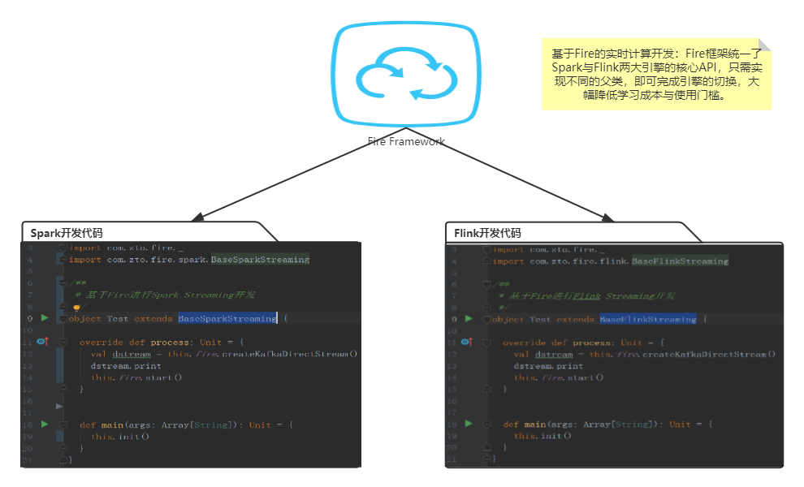

# Fire框架
​		Fire框架是由**中通**开源的，专门用于大数据**实时计算**的开发框架。该框架具有易学易用，稳定可靠等诸多优点，陪伴着中通度过了一个又一个双11。Fire框架在赋能开发者的同时，也对实时平台进行了赋能，正因为有了Fire，才真正的连接了**平台**与**任务**，消除了任务孤岛。



## 现状
​		基于Fire框架的任务在中通每天处理的数据量高达几千亿以上，覆盖了**Spark任务**（离线&实时）、**Flink任务**等主流大数据计算引擎，使用Fire框架的Spark&Flink任务占比高达99%以上。
## 赋能开发者
​		Fire框架自研发之日起就以简单高效、稳定可靠为目标。通过屏蔽技术细节、提供简洁通用的API的方式，将开发者从技术的大海中拯救出来，让开发者更专注于业务代码开发。Fire框架支持Spark与Flink两大引擎，并且覆盖离线计算与实时计算两大场景，内部提供了丰富的API，许多复杂操作仅需一行代码，大大提升了生产力。

​	接下来以HBase、JDBC为例进行简单介绍：

### HBase 操作：

`// 以多版本方式get，并将结果集封装到rdd中返回
  val studentRDD = this.fire.hbaseGetRDD(this.tableName1, classOf[Student], getRDD)
  // get到的结果以dataframe形式返回
  val studentDF = this.fire.hbaseGetDF(this.tableName1, classOf[Student], getRDD)`

### JDBC 操作：

`val insertSql = s"INSERT INTO spark_test(name, age, createTime, length, sex) VALUES (?, ?, ?, ?, ?)"
 // 指定部分DataFrame列名作为参数，顺序要对应sql中问号占位符的顺序，batch用于指定批次大小，默认取spark.db.jdbc.batch.size配置的值
 df.jdbcBatchUpdate(insertSql, Seq("name", "age", "createTime", "length", "sex"), batch = 100)`
		可以看到，Fire框架中的API是以DataFrame、RDD为基础进行了高度抽象，通过引入fire隐式转换，让RDD、DataFrame等对象直接具有了某些能力，进而实现直接调用。

## 赋能平台
​		Fire框架可以将**实时任务**与**实时管理平台**进行绑定，实现很多酷炫又实用的功能。比如配置管理、SQL在线调试、任务热重启、配置热更新等，甚至可以直接获取到任务的运行时数据，实现更细粒度的监控管理。
**配置管理**
​		类似于携程的apollo，实时任务管理平台可提供任务配置的管理功能，基于Fire的实时任务在启动时会主动拉取配置信息，并覆盖任务jar包中的配置文件，避免重复打包发布，节约时间。
**SQL在线调试**
​		基于该技术，可以在实时任务管理平台中提交SQL语句，交由指定的Spark Streaming任务执行，并将结果返回，该功能的好处是支持Spark内存临时表，便于在web端进行Spark SQL的调试，大幅节省SQL开发时间。

**定时任务**

​		有些实时任务会有定时刷新维表的需求，Fire框架支持这样的功能，类似于Spring的@Scheduled，但Fire框架的定时任务功能更强大，甚至支持指定在driver端运行还是在executor端运行。

```
/**
 * 声明了@Scheduled注解的方法将作为定时任务方法，会被Fire框架周期性调用
 *
 * @cron cron表达式
 * @scope 默认同时在driver端和executor端执行，如果指定了driver，则只在driver端定时执行
 * @concurrent 上一个周期定时任务未执行完成时是否允许下一个周期任务开始执行
 * @startAt 用于指定第一次开始执行的时间
 * @initialDelay 延迟多长时间开始执行第一次定时任务
 */
@Scheduled(cron = "0/5 * * * * ?", scope = "driver", concurrent = false, startAt = "2021-01-21 11:30:00", initialDelay = 60000)
def loadTable: Unit = {
  this.logger.info("更新维表动作")
}
```

**任务热重启**
		该功能是主要用于Spark Streaming任务，通过热重启技术，可以在不重启Spark Streaming的前提下，实现批次时间的热修改。比如在web端将某个任务的批次时间调整为10s，会立即生效。
**配置热更新**
		用户仅需在web页面中更新指定的配置信息，就可以让实时任务接收到最新的配置并且立即生效。最典型的应用场景是进行Spark任务的某个算子partition数调整，比如当任务处理的数据量较大时，可以通过该功能将repartition的具体分区数调大，会立即生效。
**运行时信息**
		基于Fire框架，可在运行时分析哪些任务读写了HBase，哪些任务操作了MySQL数据库。这就为HBase集群或MySQL维护提供了任务清单。

## 程序结构
###Spark开发
```
import com.zto.fire._
import com.zto.fire.spark.BaseSparkStreaming


/**
 * 基于Fire进行Spark Streaming开发
 */
object Test extends BaseSparkStreaming {

  /**
   * process会被fire框架主动调用
   * 在该方法中编写主要的业务代码，避免main方法过于臃肿
   */
  override def process: Unit = {
    // 从配置文件中获取kafka集群信息，并创建KafkaDataStram
    val dstream = this.fire.createKafkaDirectStream()
    dstream.print
    // 提交streaming任务执行
    this.fire.start
  }

  def main(args: Array[String]): Unit = {
    // 从配置文件中获取必要的配置信息，并初始化SparkSession、StreamingContext等对象
    this.init(10, false)
  }
}
```

###Flink开发
```
import com.zto.fire._
import com.zto.fire.flink.BaseFlinkStreaming

/**
 * Flink流式计算任务模板
 */
class Test extends BaseFlinkStreaming {

  override def process: Unit = {
    val dstream = this.fire.createKafkaDirectStream()
    dstream.print
    this.fire.start
  }

  def main(args: Array[String]): Unit = {
    this.init()
  }
}
```

