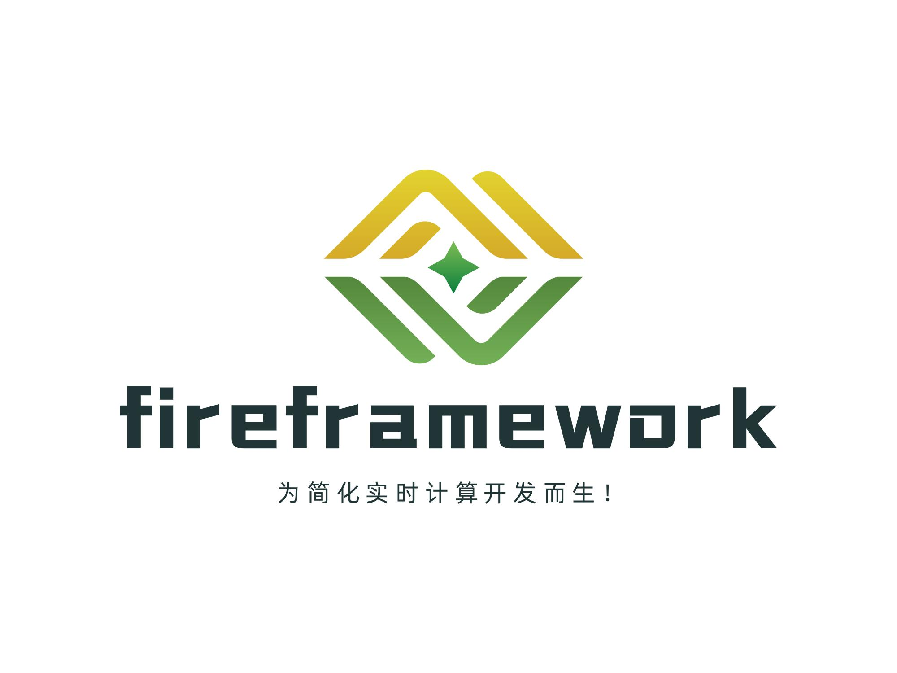

<!--
Licensed to the Apache Software Foundation (ASF) under one
or more contributor license agreements.  See the NOTICE file
distributed with this work for additional information
regarding copyright ownership.  The ASF licenses this file
to you under the Apache License, Version 2.0 (the
"License"); you may not use this file except in compliance
with the License.  You may obtain a copy of the License at

  http://www.apache.org/licenses/LICENSE-2.0

Unless required by applicable law or agreed to in writing,
software distributed under the License is distributed on an
"AS IS" BASIS, WITHOUT WARRANTIES OR CONDITIONS OF ANY
KIND, either express or implied.  See the License for the
specific language governing permissions and limitations
under the License.
-->

<p align="center">
  <a href="https://www.fireframework.cn/">
    
  </a>
  <p align="center">
    <a href="https://github.com/FireFramework/fire/stargazers">
    
    </a>
    <a href="https://github.com/FireFramework/fire/network/members">
     
    </a>
    <a href='https://gitee.com/fire-framework/fire/stargazers'></img></a>
    <a href='https://gitee.com/fire-framework/fire/members'></img></a>
		<a href='https://gitcode.com/fire-framework/fire'></img></a>
  </p>
  </p>
</p>


# Fire框架

　　Fire框架是由**中通大数据**自主研发并开源的、专门用于进行**Spark**和**Flink**任务开发的大数据框架。该框架屏蔽技术细节，提供大量简易API帮助开发者更快的构建实时计算任务。同时Fire框架也内置了平台化的功能，用于与实时平台集成。基于Fire框架的任务在中通每天处理的数据量高达**几千亿以上**，覆盖了**Spark计算**（离线&实时）、**Flink计算**等众多计算场景。

　　在数据湖与数据接入方面，Fire 深度集成 **Apache Hudi** 与 **Apache Paimon**，支持 Spark / Flink 双引擎下的实时入湖、Catalog 自动注册与 SQL 开发，详见 [Hudi Connector](./connector/hudi.md)、[Paimon Connector](./connector/paimon.md)。在 HBase、JDBC 等高频 Connector 上，Fire 3.0 进一步提供**多线程并发读写**能力（`Async` API）：在 Spark / Flink 本身**分布式并行**的基础上，于每个 Executor / Task 内部再叠加**多线程并发**，形成「**分布式 + 多线程**」双层并行模型——在相同集群资源下显著降低单任务资源开销，读写吞吐可成倍提升。详见亮点 [3.6 HBase / JDBC 多线程 API](#36-hbase--jdbc-多线程-apifire-30) 与 [HBase](./connector/hbase.md)、[JDBC](./connector/jdbc.md) 使用手册。

　　在可观测性与线上排障方面，Fire 3.0 基于 **ByteBuddy** 字节码增强，支持运行时动态统计**任意指定类/方法**的执行耗时：通过配置 `fire.trace.codeTrace.*` 即可织入目标 API，输出超过阈值的耗时日志，**无需修改业务代码、无需重启任务**，便于快速定位 Connector、UDF 或自定义逻辑的性能瓶颈。详见亮点 [3.16 运行时 API 耗时统计](#316-运行时-api-耗时统计bytebuddy)。

## 一、就这么简单！

### 1.1 Flink开发示例

```scala
@Config(
  """
    |state.checkpoints.num-retained=30 	# 支持任意Flink调优参数、Fire框架参数、用户自定义参数等
    |state.checkpoints.dir=hdfs:///user/flink/checkpoint
    |""")
@Hive("thrift://localhost:9083") // 配置连接到指定的hive
@Streaming(interval = 100, unaligned = true) // 100s做一次checkpoint，开启非对齐checkpoint
@Kafka(brokers = "localhost:9092", topics = "fire", groupId = "fire")
object FlinkDemo extends FlinkStreaming {

  @Process
  def kafkaSource: Unit = {
    val dstream = this.fire.createKafkaDirectStream() 	// 使用api的方式消费kafka
    sql("""create table statement ...""")
    sql("""insert into statement ...""")
  }
}
```

### 1.2 Spark开发示例

```scala
@Config(
  """
    |spark.shuffle.compress=true		# 支持任意Spark调优参数、Fire框架参数、用户自定义参数等
    |spark.ui.enabled=true
    |""")
@Hive("thrift://localhost:9083") // 配置连接到指定的hive
@Streaming(interval = 100, maxRatePerPartition = 100) // 100s一个Streaming batch，并限制消费速率
@Kafka(brokers = "localhost:9092", topics = "fire", groupId = "fire")
object SparkDemo extends SparkStreaming {

  @Process
  def kafkaSource: Unit = {
    val dstream = this.fire.createKafkaDirectStream() 	// 使用api的方式消费kafka
    sql("""select * from xxx""").show()
  }
}
```

***说明：structured streaming、spark core、flink sql、flink批任务均支持，代码结构与上述示例一致。***

## *二、开发与示例*

## 2.1 [Spark开发示例](https://gitee.com/fire-framework/spark-examples)

## 2.2 [Flink开发示例](https://gitee.com/fire-framework/flink-examples)

**示例项目clone后导入idea即可run，无需任何额外配置！**

## 三、亮点多多！

### 3.1 兼容主流版本

　　fire框架适配了不同的spark与flink版本，支持spark2.x及以上所有版本，flink1.10及以上所有版本，支持基于scala2.11或scala2.12进行编译。

```shell
# 可根据实际需要选择不同的引擎版本进行fire框架的构建
mvn clean install -DskipTests -Pspark-3.0 -Pflink-1.14 -Pscala-2.12
```

| Apache Spark | Apache Flink |
| ------------ | ------------ |
| 2.3.x        | 1.12.x       |
| 2.4.x        | 1.13.x       |
| 3.0.x        | 1.14.x       |
| 3.1.x        | 1.15.x       |
| 3.2.x        | 1.16.x       |
| 3.3.x        | 1.17.x       |
| 3.4.x        | 1.18.x       |
| 3.5.x        | 1.19.x       |

### **3.2 简单好用**

　　Fire框架高度封装，屏蔽大量技术细节，许多connector仅需一行代码即可完成主要功能。同时Fire框架统一了spark与flink两大引擎常用的api，使用统一的代码风格即可实现spark与flink的代码开发。

- **HBase API**

```scala
// 读取HBase中指定rowkey数据并将结果集封装为DataFrame返回
val studentDF: DataFrame = this.fire.hbaseGetDF(hTableName, classOf[Student], getRDD)
// 将指定数据集分布式插入到指定HBase表中
this.fire.hbasePutDF(hTableName, studentDF, classOf[Student])

// Fire 3.0：多线程并发读写（方法名带 Async 后缀，keyNum 始终在最后）
this.fire.hbasePutListAsync[Student](hTableName, threadNum = 3, studentList)
studentDF.hbasePutDFAsync[Student](hTableName, threadNum = 3, keyNum = 2)
```

- **JDBC API**

1. **通过注解配置数据源：**

```java
@Jdbc(url = "jdbc:mysql://mysql-server:3306/fire", username = "root", password = "root")
```

2. **Spark示例：**

```scala
// 将DataFrame中指定几列插入到关系型数据库中，每100条一插入
df.jdbcBatchUpdate(insertSql, Seq("name", "age", "createTime", "length", "sex"), batch = 100)
// 将查询结果通过反射映射到DataFrame中
val df: DataFrame = this.fire.jdbcQueryDF(querySql, Seq(1, 2, 3), classOf[Student])

```

3. **Flink示例：**

```scala
val dstream = this.fire.createKafkaDirectStream().map(t => JSONUtils.parseObject[Student](t))
val sql =
s"""
|insert into spark_test(name, age, createTime) values(?, ?, ?)
|ON DUPLICATE KEY UPDATE age=18
|""".stripMargin
// sinkJdbc只需指定sql语句即可，fire会自动推断sql中占位符与JavaBean中成员变量的对应关系
dstream.sinkJdbc(sql)
dstream.sinkJdbcExactlyOnce(sql, keyNum = 2)

// Fire 3.0：多线程批量写入（Flink 使用独立 JdbcAsyncSink，keyNum 始终在最后）
stream.jdbcBatchUpdateAsync2(sql, threadNum = 3, keyNum = 2) { value => Seq(value.getName, value.getAge) }
```

　　Fire 3.0 起，HBase 与 JDBC 的 Java API 均提供**多线程并发读写**能力，Spark 与 Flink 统一采用 **`Async` 后缀**命名，不影响已有同步 API。详见亮点 [3.6](#36-hbase--jdbc-多线程-apifire-30) 节。

### **3.3 灵活的配置方式**

　　支持基于接口、apollo、配置文件以及注解等多种方式配置，支持将spark&flink等**引擎参数**、**fire框架参数**以及**用户自定义参数**混合配置，支持运行时动态修改配置。几种常用配置方式如下（[配置手册](./docs/config.md)）：

1. **基于配置文件：** 创建类名同名的properties文件进行参数配置
2. **基于接口配置：** fire框架提供了配置接口调用，通过接口获取所需的配置，可用于平台化的配置管理
3. **基于注解配置：** 通过注解的方式实现集群环境、connector、调优参数的配置，常用注解如下：

```scala
@Config(
  """
    |# 支持Flink调优参数、Fire框架参数、用户自定义参数等
    |state.checkpoints.num-retained=30
    |state.checkpoints.dir=hdfs:///user/flink/checkpoint
    |""")
@Hive("thrift://localhost:9083")
@Checkpoint(interval = 100, unaligned = true)
@Kafka(brokers = "localhost:9092", topics = "fire", groupId = "fire")
@RocketMQ(brokers = "bigdata_test", topics = "fire", groupId = "fire", tag = "*", startingOffset = "latest")
@Jdbc(url = "jdbc:mysql://mysql-server:3306/fire", username = "root", password = "..root726")
@HBase("localhost:2181")
```

**配置获取：**

　　Fire框架封装了统一的配置获取api，基于该api，无论是spark还是flink，无论是在Driver | JobManager端还是在Executor | TaskManager端，都可以一行代码获取所需配置。这套配置获取api，无需再在flink的map等算子中复写open方法了，用起来十分方便。

```scala
this.conf.getString("my.conf")
this.conf.getInt("state.checkpoints.num-retained")
...
```

### **3.4 多集群支持**

　　Fire框架的配置支持N多集群，比如同一个任务中可以同时配置多个HBase、Kafka数据源，使用不同的数值后缀即可区分（**keyNum**）：

```scala
// 假设基于注解配置HBase多集群如下：
@HBase("localhost:2181")
@HBase2(cluster = "192.168.0.1:2181", storageLevel = "DISK_ONLY")

// 代码中使用对应的数值后缀进行区分
this.fire.hbasePutDF(hTableName, studentDF, classOf[Student])	// 默认keyNum=1,表示使用@HBase注解配置的集群信息
this.fire.hbasePutDF(hTableName2, studentDF, classOf[Student], keyNum=2)	// keyNum=2，表示使用@HBase2注解配置的集群信息
```

### **3.5 常用 connector 支持**

　　支持 Kafka、RocketMQ、Paimon、Redis、HBase、JDBC、ClickHouse、Hive、TiDB、ADB 等常见 Connector；同时深度集成两大湖存储格式：

| Connector  | 引擎          | 能力概要                                                     | 文档                                           |
| ---------- | ------------- | ------------------------------------------------------------ | ---------------------------------------------- |
| **HBase**  | Spark / Flink | 同步读写 + **Fire 3.0 多线程 `Async` API**                   | [HBase Connector](./docs/connector/hbase.md)   |
| **JDBC**   | Spark / Flink | 一行批量写 + **Fire 3.0 多线程 `Async` API**                 | [JDBC Connector](./docs/connector/jdbc.md)     |
| **Hudi**   | Spark / Flink | Streaming 实时入湖、`df.sinkHudi`、`@Hudi` 注解、Flink SQL `connector='hudi'` | [Hudi Connector](./docs/connector/hudi.md)     |
| **Paimon** | Spark / Flink | 自动注册 Catalog、`PaimonCore`/`PaimonStreaming` 父类、`@Paimon` 注解 | [Paimon Connector](./docs/connector/paimon.md) |

> HBase / JDBC 多线程特性详见亮点 **[3.6 HBase / JDBC 多线程 API](#36-hbase--jdbc-多线程-apifire-30)**。

**Hudi 版本（Maven Profile）：** `hudi-0.8`（0.8.0）· `hudi-0.9`（0.9.0）· `hudi-0.10`（0.10.1）· `hudi-0.13`（0.13.0）· `hudi-1.0.0`（1.0.0-beta1）

**Paimon 版本（Maven Profile）：** `paimon-0.8`（0.8.2）· `paimon-0.9`（0.9.0）· `paimon-1.0.1`（1.0.1.4-SNAPSHOT）· `paimon-1.1.1`（1.1.1）· `paimon-1.2.0`（1.2.0）· `paimon-1.3.1`（1.3.1）

```shell
# 构建示例：Spark 3.3 + Hudi 0.13 + Paimon 1.2.0
mvn clean install -DskipTests -Pspark-3.3 -Phudi-0.13 -Ppaimon-1.2.0 -Pscala-2.12
```

**Spark Hudi 实时入湖示例：**

```scala
@Hudi(parallelism = 10, compactCommits = 2)
@Streaming(interval = 20)
@RocketMQ(brokers = "bigdata_test", topics = "datacloud", groupId = "fire")
object HudiDemo extends HudiStreaming {
  override protected def sqlUpsert(tmpView: String): String =
    s"select id, name, age, createTime, ds from $tmpView"
}
```

**Spark Paimon 查询示例：**

```scala
@Hive("thrift://localhost:9083")
object PaimonDemo extends PaimonCore {
  override def process(): Unit = {
    sql("select * from paimon.db.my_table where ds='20260101'").show()
  }
}
```

详细 API、配置与示例见 [hudi.md](./docs/connector/hudi.md) 与 [paimon.md](./docs/connector/paimon.md)。

### **3.6 HBase / JDBC 多线程 API（Fire 3.0）**

　　Fire 3.0 在 HBase 与 JDBC 之上封装了**多线程并发读写**能力，适用于中等数据量的高吞吐场景。Spark 与 Flink **API 风格统一**：方法名带 **`Async`** 后缀，与同步 API 相互独立，已有代码零改动即可继续运行。

**核心特性：**

| 能力 | HBase | JDBC |
| --- | --- | --- |
| Spark 分布式写 | `df.hbasePutDFAsync` / `rdd.hbasePutRDDAsync` | `df.jdbcUpdateBatchAsync` |
| Spark 并发读 | `fire.hbaseGetListAsync2` / `hbaseScanListAsync2` | `fire.jdbcQueryDFAsync` |
| Flink 流式 Sink | `stream.hbasePutDSAsync2` / `HBaseAsyncSink` | `stream.jdbcBatchUpdateAsync2` / `JdbcAsyncSink` |
| 默认线程数 | `fire.hbase.thread.num`（默认 2） | `fire.jdbc.thread.num`（默认 2） |

**设计约定：**

- **`threadNum`** 控制并发线程数，可通过配置或 API 参数指定
- **`keyNum` 始终放在参数列表最后**，用于 `@HBase2` / `@Jdbc2` 等多集群场景
- Flink 使用独立的 **`HBaseAsyncSink`** / **`JdbcAsyncSink`**，避免在原 Sink 签名中插入 `threadNum` 导致 `keyNum` 误传

```scala
// Spark HBase 多线程写入 + Get
this.fire.hbasePutListAsync[Student](tableName, threadNum = 3, studentList)
this.fire.hbaseGetListAsync2[Student](tableName, threadNum = 2, rowKeys)

// Spark JDBC 多线程批量写 + 查询
df.jdbcUpdateBatchAsync(insertSql, fields, threadNum = 3)
val df = this.fire.jdbcQueryDFAsync(querySql, paramsList, threadNum = 3)

// Flink 多线程 Sink
stream.hbasePutDSAsync2(tableName, threadNum = 3) { value => value }
stream.jdbcBatchUpdateAsync2(sql, threadNum = 3, keyNum = 2) { v => Seq(v.getName, v.getAge) }
```

**详细文档：** [HBase 多线程 API](./docs/connector/hbase.md#14-多线程-api) · [JDBC 多线程 API](./docs/connector/jdbc.md#22-spark-多线程-api) · [配置参数](./docs/properties.md#四jdbc-连接器)

### **3.7 [checkpoint热修改](./docs/highlight/checkpoint.md)**

　　支持运行时动态调整checkpoint周期、超时时间、并行checkpoint等参数，避免任务重启时由于反压带来的checkpoint压力。

### **3.8 [streaming热重启](./docs/highlight/spark-duration.md)**

　　该功能是主要用于Spark Streaming任务，通过热重启技术，可以在不重启Spark Streaming的前提下，实现批次时间的热修改。比如在web端将某个任务的批次时间调整为10s，会立即生效。

### **3.9 配置热更新**

　　用户仅需在web页面中更新指定的配置信息，就可以让实时任务接收到最新的配置并且立即生效。最典型的应用场景是进行Spark任务的某个算子partition数调整，比如当任务处理的数据量较大时，可以通过该功能将repartition的具体分区数调大，会立即生效。

### **3.10 在线性能诊断**

　　深度集成Arthas，可对运行中的任务动态进行性能诊断。fire为arthas诊断提供rest接口，可通过接口调用的方式选择为driver、jobmanager或executor、taskmanager动态开启与关闭arthas诊断线程，然后向统一的arthas tunnel服务注册，即可在网页端输入arthas命令进行性能诊断。


### **3.11 sql在线调试**

　　Fire框架对外暴露了restful接口，平台等系统可通过接口调用的方式将待执行的sql语句动态传递给fire，由fire将sql提交到对应的引擎，并将sql执行结果通过接口调用的方式返回，实现实时任务sql开发的在线调试，避免重复修改代码发布执行带来的时间成本。

### **3.12 实时血缘**

　　Fire框架支持运行时统计分析每个任务所使用到的数据源信息、库表信息、操作类型等，并将这些血缘信息通过接口的方式对外暴露。实时平台等web系统通过接口调用的方式即可获取到实时血缘信息。截止目前，Fire框架支持高达**30多**种主流connector的血缘解析，包括：paimon、hudi、doris、hive、jdbc、StarRocks、HBase等等。Fire框架会将解析的血缘拼接成json格式，通过配置的地址周期性发送到指定的**kafka topic**中，下游实时平台消费血缘信息并做展示即可。


​		Fire框架同时支持**Spark**与**Flink**两大流式计算引擎的血缘解析，可实现全面洞悉数据流转链路、打通离线与实时计算的血缘形成闭环、还可协助快速定位线上的问题。		

### **3.13 定时调度**

　　Fire框架内部封装了quartz框架，实现通过Scheduled注解即可完成定时任务的注册。

```scala
  /**
   * 声明了@Scheduled注解的方法是定时任务方法，会周期性执行
   *
   * @scope 默认同时在driver端和executor端执行，如果指定了driver，则只在driver端定时执行
   * @initialDelay 延迟多长时间开始执行第一次定时任务
   */
  @Scheduled(cron = "0/5 * * * * ?", scope = "driver", initialDelay = 60000)
  def loadTable: Unit = {
    this.logger.info("更新维表动作")
  }
```

### **3.14 平台无缝集成**

　　Fire框架内置restful服务，并将许多功能通过接口的方式对外暴露，实时平台可以通过fire框架暴露的接口实现与每个实时任务的信息连接。

### **3.15 fire-shell**

　　Fire框架整合spark shell与flink shell，支持通过REPL方式去动态调试spark和flink任务，并且支持fire框架的所有API。fire框架将shell能力通过接口方式暴露给实时平台，如此一来就可以通过web页面去调试spark和flink任务了。

### **3.16 运行时 API 耗时统计（ByteBuddy）**

　　Fire 3.0 基于 **ByteBuddy** 字节码增强，在任务**运行时**动态织入指定类/方法，统计其执行耗时并输出日志，无需修改业务代码、无需重启任务即可热启停。

**典型场景：** 排查某个 Connector 方法、自定义 UDF 或平台封装 API 的线上耗时瓶颈。

**配置示例：**

```properties
fire.trace.codeTrace.enable=true
# 逗号分隔：全限定类名.方法名 或 全限定类名.*（* 表示该类全部方法）
fire.trace.codeTrace.class=com.zto.fire.hbase.HBaseConnector.put,com.zto.fire.jdbc.JdbcConnector.*
fire.trace.codeTrace.thresholdMs=10
```

**工作原理：**

1. 任务启动后，Fire 通过 Java Agent 安装 ByteBuddy Transformer，对配置中的目标方法织入 `TracePerformanceAdvice`
2. 每次方法调用记录入参、返回值与耗时；仅当耗时 **≥ 阈值** 时打印 WARN 日志，避免日志风暴
3. 支持运行时**热更新**追踪目标（先停止再重启增强），便于线上按需开启/关闭

**日志示例：**

```
[TracePerformance] 方法名称：com.zto.fire.hbase.HBaseConnector.put 参数：[...] 返回值：null 耗时：35ms
```

**相关配置：** 详见 [fire.trace.* 配置项](./properties.md#33-代码-trace-与标准化firetrace)

### **3.17 代码标准化检测（ByteBuddy）**

　　Fire 框架对 Kafka、HBase、JDBC 等 Connector 做了深度封装，统一了 Spark 与 Flink 的开发体验。但在实际项目中，开发者仍可能绕过 Fire API，直接调用 **HBase Client、JDBC Driver、Kafka Producer** 等原生 SDK。

　　Fire 3.0 同样基于 **ByteBuddy**，在运行时动态检测「Fire 已提供封装、但业务代码却直连原生 API」的不规范用法，帮助团队统一代码风格、便于平台化治理与血缘解析。

**配置示例：**

```properties
fire.trace.codeStandard.enable=true
# Base64 编码的 JSON 数组，映射「原生 API」→「建议使用的 Fire 封装包前缀」
fire.trace.codeStandard.api=W3sic291cmNlIjoib3JnLmFwYWNoZS5oYWRvb3AuaGJhc2UuY2xpZW50LkNvbm5lY3Rpb24uZ2V0VGFibGUiLCJ0YXJnZXQiOiJjb20uenRvLmZpcmUifV0=
fire.trace.codeStandard.durationMin=10
fire.trace.codeStandard.autoExit=false
fire.trace.codeStandard.stackScanDepth=28
# 可选：将检测结果周期性发送到 Kafka，供实时平台展示
fire.trace.codeStandard.send.mq.url=localhost:9092
fire.trace.codeStandard.send.mq.topic=fire_trace_standard
```

**API 映射 JSON 格式（配置前需 Base64 编码）：**

```json
[
  { "source": "org.apache.hadoop.hbase.client.Connection.getTable", "target": "com.zto.fire" },
  { "source": "java.sql.Connection.prepareStatement", "target": "com.zto.fire" },
  { "source": "org.apache.kafka.clients.producer.KafkaProducer.*", "target": "com.zto.fire" }
]
```

**工作原理：**

1. 按 `source` 配置匹配原生 API 的实现类与方法（支持 `类.*` 通配），在方法入口织入 `TraceStandardAdvice`
2. 扫描当前线程调用栈：若调用链中**未出现** `target` 指定的 Fire 封装包，则判定为「直连原生 API」
3. 输出 WARN 日志，包含原生方法、建议使用的 Fire API 包前缀，以及**业务代码中的具体调用位置**（类名、方法名、行号）
4. 检测结果可汇总到 Driver/JobManager，并按配置周期发送到 Kafka；`autoExit=true` 时可在发现违规后快速退出任务（适用于 CI/预发环境）

**日志示例：**

```
[TraceStandard] 检测到代码正在使用原生API：source=org.apache.hadoop.hbase.client.Connection.getTable method=...；Fire已提供封装后的API，建议使用：com.zto.fire；调用位置：class=com.example.MyJob method=process line=42
```

**与 3.16 的区别：** 3.16 关注**指定方法的耗时**；3.17 关注**是否使用了 Fire 推荐的封装 API**，两者可独立开启，也可同时启用。

## *[四、升级日志](./docs/feature.md)*

## 五、期待你的加入

**社区技术交流：[*35373471(钉钉)*](https://qr.dingtalk.com/action/joingroup?code=v1,k1,yNUn3bjLGYXPHvzVapvFjI7H5LQReBVrksiECWH+WAI=&_dt_no_comment=1&origin=11)**

**入群请备注：<font color='red'>公司名称-岗位-昵称</font>，否则不予理会**

<center class="half">
    
    
</center>
