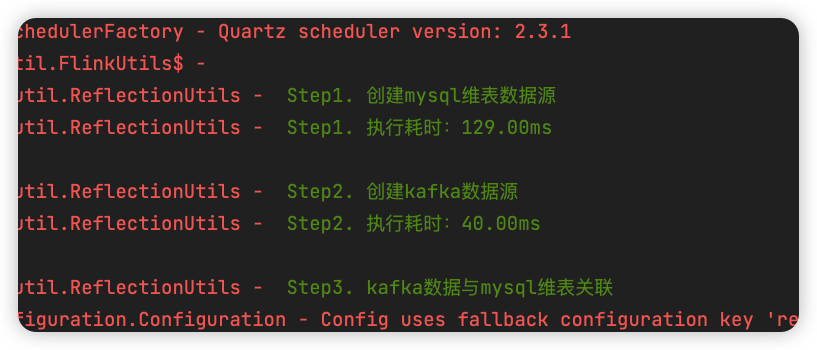

# Fire框架--基于**注解**快速进行Flink和Spark任务开发

　　实时计算一直是大数据领域最热门的技术，很多实时开发者可能都有Java Web研发经验，从Web开发转到实时开发，都会有一个“天真”的想法：能不能将Spring集成到Spark或Flink项目中呢？能不能通过某种封装简化冗余代码呢？答案是当然可以！Fire框架针对Spark与Flink两大引擎进行了高度封装，并对开发者暴露统一的API，进一步节约了代码量。

## 快速入门案例


　　通过上面的案例可以看到，集成了Fire框架后，只需继承框架提供的父类，即可在标记了@Process注解的方法中开发代码。

## SQL开发解耦

　　对于纯SQL开发场景，Fire框架一样可以简化不少代码量：


上述代码，Fire框架会根据代码中**@Step**注解的顺序，依次执行代码逻辑，并在日志中打印注解中的描述信息：



## 注解含义（Spark与Flink通用）

- **@Config：**该注解支持Flink、Spark引擎相关参数、Fire框架参数以及用户自定义参数。对于引擎相关配置信息，会在构建**SparkSession**或Flink **environment**时自动设置生效，避免编写大量重复的用于构建引擎上文的代码。
- **@Streaming：**该注解支持Flink的Checkpoint相关参数，包括频率、超时时间等，还可以进行任务并发度的配置。而对于Spark Streaming任务，则用于设置批次时间、是否开启反压，以及反压情况下消费速率等参数。
- **@Kafka：**该注解用于配置任务中使用到的kafka集群信息，以及kafka-client相关调优参数。如果任务中消费多个kafka，可以使用@Kafka2、@Kafka3这种写法。
- **@Hive：**hive注解用于指定任务中所使用的hive数仓thrift server地址。支持HDFS HA，支持跨集群读写Hive。
- **@Process：**该注解用于标记用户代码的入口，标记了@Process的方法会被Fire框架自动调起。
- **@HBase**：用于配置HBase相关连接信息

```scala
// 假设基于注解配置HBase多集群如下：
@HBase("localhost:2181")
@HBase2(cluster = "192.168.0.1:2181", storageLevel = "DISK_ONLY")

// 代码中使用对应的数值后缀进行区分
this.fire.hbasePutDF(hTableName, studentDF, classOf[Student])	// 默认keyNum=1,表示使用@HBase注解配置的集群信息
this.fire.hbasePutDF(hTableName2, studentDF, classOf[Student], keyNum=2)	// keyNum=2，表示使用@HBase2注解配置的集群信息
```

- **@JDBC**：用于配置jdbc相关信息，Fire框架内部封装了数据库连接池，会自动获取该注解的配置信息。

```scala
@Jdbc(url = "jdbc:derby:memory:fire;create=true", username = "fire", password = "fire")
val insertSql = s"INSERT INTO $tableName (name, age, createTime, length, sex) VALUES (?, ?, ?, ?, ?)"
this.fire.jdbcUpdate(insertSql, Seq("admin", 12, timestamp, 10.0, 1))
```

- **@Scheduled**：用法类似于Sping，支持在Spark Streaming或Flink任务中周期性任务。

```scala
  /**
   * 声明了@Scheduled注解的方法是定时任务方法，会周期性执行
   *
   * @scope 默认同时在driver端和executor端执行，如果指定了driver，则只在driver端定时执行
   * @initialDelay 延迟多长时间开始执行第一次定时任务
   */
  @Scheduled(cron = "0/5 * * * * ?", scope = "driver", initialDelay = 60000)
  def loadTable: Unit = {
    this.logger.info("更新维表动作")
  }
```

- **@Before：**生命周期注解，用于在Fire框架初始化引擎上下文之前调用。
- **@After：**生命周期注解，用于在Fire退出jvm之前调用，可用于Spark批任务回收数据库连接池等对象。

## 参考文章：

[Fire框架--快速的进行Spark与Flink开发](https://zhuanlan.zhihu.com/p/540808612)